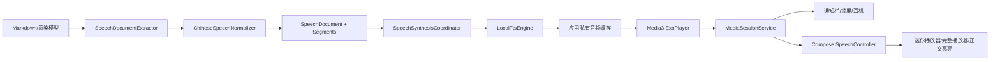

# 语音朗读技术方案

| 项目 | 内容 |
|---|---|
| 版本 | `0.2 Draft` |
| 平台 | Android API 28–36 |
| 合成 | Android `TextToSpeech` 本地离线音色 |
| 播放 | AndroidX Media3 `MediaSessionService` |
| 数据边界 | 应用私有存储，全程本地 |

## 1. 技术决策

不直接使用 `TextToSpeech.speak()` 承担完整播放生命周期，而是采用“语义分段 → 本地逐段合成文件 → Media3 队列播放”。

原因如下：

- 音频文件可实现准确暂停、恢复、跳转和倍速播放；
- Media3 原生支持后台前台服务、媒体通知、锁屏和蓝牙控制；
- 先合成前两段即可开播，其余段落边播边生成；
- 合成结果可缓存，同一文章再次播放不必重复 TTS；
- 播放倍速由播放器处理，无需为每个倍速重复合成；
- TTS 引擎异常与播放器生命周期可以解耦并单独测试。

## 2. 总体架构



### 2.1 模块职责

| 组件 | 职责 |
|---|---|
| `SpeechDocumentExtractor` | 从 Markdown AST/现有渲染模型提取可朗读语义块，不从 WebView 可见文本反向猜测结构 |
| `ChineseSpeechNormalizer` | 数字、单位、日期、缩写、链接和符号规范化 |
| `SpeechSegmenter` | 按语义与标点切段，控制引擎输入上限 |
| `SpeechProvider` | TTS 能力抽象，便于测试和未来接入用户自带服务 |
| `LocalTtsEngine` | 初始化系统 TTS、筛选离线中文音色、合成单段文件 |
| `SpeechSynthesisCoordinator` | 维护合成队列、预取、重试、取消和并发约束 |
| `SpeechCache` | 原子写入、命中、校验、内容失效和 LRU 清理 |
| `SpeechPlaybackService` | `MediaSessionService`、ExoPlayer、音频焦点与后台生命周期 |
| `SpeechController` | UI 与 `MediaController` 的连接、命令和状态映射 |
| `SpeechStateStore` | 保存文章、段落、段内时间、倍速、音色和更新时间 |

## 3. 数据模型

```kotlin
data class SpeechDocument(
    val documentId: String,
    val contentHash: String,
    val title: String,
    val segments: List<SpeechSegment>
)

data class SpeechSegment(
    val id: String,
    val blockId: String,
    val type: SpeechSegmentType,
    val normalizedText: String
)

data class SpeechPlaybackState(
    val documentId: String,
    val contentHash: String,
    val voiceId: String,
    val segmentIndex: Int,
    val positionMs: Long,
    val speed: Float,
    val updatedAtEpochMs: Long
)
```

- `documentId` 由仓库标识、分支和文档路径稳定生成，日志中只记录不可逆摘要。
- `contentHash` 基于源文档内容和朗读规则版本生成；正文或规则变化会自动失效旧缓存。
- `blockId` 与渲染器 DOM/Compose 块 ID 对齐，用于高亮和点击段落开播。
- 状态使用 DataStore 保存；写入按段切换、暂停、退到后台和定时节流触发。

## 4. 文本提取与中文规范化

### 4.1 提取

复用 Markdown 解析结果生成朗读模型，过滤 Front matter 和不可读标记。标题、段落、列表、引用、代码、图片及表格分别处理，避免把 HTML 标签或 Markdown 分隔符交给 TTS。

表格默认仅生成摘要段：`表格，共 6 行 3 列`。用户选择逐行朗读时，按“列名，单元格内容”生成段落，空单元格跳过。

### 4.2 分段

- 目标长度为每段约 100–300 个汉字；
- 优先按段落和句末标点切分，再按逗号等次级标点切分；
- 不得超过 `TextToSpeech.getMaxSpeechInputLength()`；
- 超长 URL、代码或不可读字符序列直接过滤或摘要；
- 每段 ID 由 `blockId + normalizedText hash + ordinal` 生成。

### 4.3 规范化管线

按固定顺序执行并保留单元测试快照：

1. Unicode 和空白标准化；
2. 去除 Markdown/HTML 控制符；
3. 链接、脚注、图片和代码策略；
4. 日期、时间、百分比、金额、单位和序号转换；
5. 中英文缩写发音词典；
6. 标点与停顿修正；
7. 最终长度和不可见字符校验。

词典首期随应用内置 JSON，个人词典以 DataStore/Room 保存并在内置词典后覆盖。任何替换规则必须限定边界，避免误改普通单词。

## 5. 本地 TTS

### 5.1 音色发现

TTS 初始化成功后读取可用 `Voice`，只展示满足以下条件的音色：

- `Locale` 为中文或用户允许的其他语言；
- `isNetworkConnectionRequired == false`；
- 引擎报告为可用。

默认音色按语言匹配、质量、延迟和用户历史选择排序。UI 展示 TTS 引擎包名、音色名、区域、质量和离线状态。切换音色会更换缓存键，但不删除旧缓存。

### 5.2 合成调度

- 同一时刻只允许一个 TTS 合成任务，兼容保守型厂商引擎；
- 用户点击播放时优先合成当前段及下一段；
- 播放开始后保持至少两个已就绪段的预取水位；
- 使用 `synthesizeToFile` 和唯一 utterance ID；
- 回调成功后验证文件存在、长度非零且播放器可解析；
- 写入 `.tmp`，验证后原子重命名为正式文件；
- 单段失败自动重试一次，之后标记失败并允许跳过；
- 切换文章、音色或内容版本时取消尚未开始的任务，忽略迟到回调。

应用销毁时正确调用 `TextToSpeech.shutdown()`。不假设输出文件扩展名代表固定编码，以引擎实际输出和 Media3 可解析性为准。

## 6. 音频缓存

建议布局：

```text
cacheDir/speech/
  <document-id-hash>/
    <content-hash>/
      <voice-id-hash>/
        manifest.json
        segment-0000.audio
        segment-0001.audio
```

`manifest.json` 保存规则版本、段落 ID、音频时长、文件校验信息和完成状态。倍速不进入缓存键，因为倍速由 Media3 实时处理。

缓存默认上限 500 MB，按最近访问时间 LRU 清理：

- 不清理当前播放和当前合成文件；
- 内容哈希变化后旧版本优先回收；
- 空间不足时先清理再重试一次；
- 提供按文章和全部清理；
- 目录位于应用私有 `cacheDir` 并排除备份。

## 7. Media3 播放与后台服务

### 7.1 服务

实现 `SpeechPlaybackService : MediaSessionService`，内部持有一个 ExoPlayer 和 MediaSession。每个语音段对应一个 `MediaItem`，队列可在后续段合成完成时追加。

Manifest 至少声明：

```xml
<uses-permission android:name="android.permission.FOREGROUND_SERVICE" />
<uses-permission android:name="android.permission.FOREGROUND_SERVICE_MEDIA_PLAYBACK" />

<service
    android:name=".speech.SpeechPlaybackService"
    android:exported="false"
    android:foregroundServiceType="mediaPlayback">
    <intent-filter>
        <action android:name="androidx.media3.session.MediaSessionService" />
    </intent-filter>
</service>
```

Android 13 及以上适时请求通知权限；用户拒绝时说明系统层面的控制入口可能受限，但不将权限拒绝误判为 TTS 不可用。

### 7.2 播放属性与音频焦点

- `AudioAttributes.USAGE_MEDIA`；
- `CONTENT_TYPE_SPEECH`；
- 由 Media3 管理音频焦点；
- 语音内容遇到 duck 请求时暂停，而非压低音量继续说；
- 停止播放时释放焦点和不再需要的资源；
- 监听耳机断开事件并暂停。

Android 15 对音频焦点有更严格的前台限制，因此播放必须由正在运行的媒体前台服务承载。

### 7.3 生命周期

- 用户主动播放后启动服务并创建媒体通知；
- 暂停时保留会话与恢复状态，超过设定空闲时间（建议 10 分钟）可停止前台服务；
- 从最近任务划掉应用时，正在播放可继续，主动停止或播放完成后退出服务；
- 服务被系统终止后不自动外放，用户再次进入应用时提供“继续朗读”；
- `onTaskRemoved`、`onDestroy`、播放器错误和进程重建均写入最终进度。

## 8. UI 与正文联动

Compose 侧通过 `MediaController` 连接服务，所有页面观察统一 `SpeechUiState`，避免页面直接持有播放器。

Markdown 渲染时为每个可朗读块注入稳定 `blockId`。播放段变化后：

1. 服务通过 MediaSession extras/custom layout 或共享状态发布当前 `blockId`；
2. 阅读页调用 WebView JavaScript/Compose 状态设置高亮；
3. 开启跟随时滚动到该块；
4. 用户主动滚动后进入“手动阅读”状态，直到点击回到朗读位置。

自定义命令用于“上一段、下一段、从 blockId 开始、表格逐行朗读”，标准播放命令继续用于通知栏和外部设备兼容。

## 9. 隐私、安全与可观测性

- 不包含云 TTS SDK，不提供隐式网络回退。
- TTS 原文和音频只存在于应用私有空间，不申请公共存储权限。
- 明确排除音频缓存和播放状态的 Android 备份。
- 日志只记录文档摘要、段号、耗时和错误码，不记录正文、仓库令牌、私有路径或音频内容。
- TTS 引擎属于系统/用户安装组件；设置页透明展示当前引擎及音色是否声明需要网络。
- 指标仅本地用于诊断：首次出声耗时、合成耗时、缓存命中、播放卡顿和错误码。

## 10. 测试接口与降级

核心依赖使用接口隔离：

```kotlin
interface SpeechProvider {
    suspend fun availableVoices(): List<SpeechVoice>
    suspend fun synthesize(request: SpeechRequest, output: File): SpeechResult
    fun cancel()
}
```

单元和集成测试使用确定性的 Fake Provider 生成短测试音频，不依赖设备 TTS。真机冒烟测试再覆盖实际引擎。

降级顺序：

1. 首选用户指定的离线中文音色；
2. 回退到同语言的其他离线音色；
3. 无离线中文音色时停止并引导安装；
4. 永不静默使用联网音色。

## 11. 实施顺序

1. 建立朗读模型、Markdown 提取、中文规范化和单元测试。
2. 实现 `LocalTtsEngine`、音色发现、逐段文件合成与缓存。
3. 接入 Media3 服务、媒体通知、音频焦点和恢复状态。
4. 完成文章入口、迷你播放器、完整播放器和倍速控制。
5. 完成正文高亮、点击段落开播和滚动跟随。
6. 补齐异常引导、缓存设置、隐私检查及真机端到端验证。

## 12. 官方参考

- [Android TextToSpeech API](https://developer.android.com/reference/android/speech/tts/TextToSpeech)
- [Android Voice API](https://developer.android.com/reference/android/speech/tts/Voice)
- [Media3 后台播放](https://developer.android.com/media/media3/session/background-playback)
- [Android 音频焦点](https://developer.android.com/media/optimize/audio-focus)
